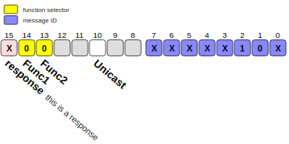

# bitInfo

BitInfo will read a bitmap description and generate a SVG image to it.

It was designed specially to integrate with [Markdown Preview Enhanced](https://shd101wyy.github.io/markdown-preview-enhanced/#/) and its [Code chunk](https://shd101wyy.github.io/markdown-preview-enhanced/#/code-chunk) feature.

<!--  -->
<!--  -->
<!--  -->


## Install

Easy way is to install it globally:

```bash
npm i -g bitinfo
```

## Usage

Markdown Preview Enhanced integrates lots of diagram generator. Since bitInfo is not one of them we must use **code chunk** feature to include it.

Simple add a fenced block and add a call to the bitinfo (change its path if not globally installed):

````markdown
```bitinfo {cmd="bitinfo", args=["-i"] output="html" hide}
size 16
15 response =x "this is a response" #fdd
14..13 Func1,Func2 =00
highlight 14..13 "function selector"
7..0 =xxxxx10x
highlight 7..0 #88f "message ID"
10 Unicast
```
````

Then use any of commands `Run Code Chunk` or `Run All Code Chunk` to generate diagrams.

<!-- ```bitinfo {cmd="bitinfo", args=["-i"] output="html" hide}
size 16
15 response =x "this is a response" #fdd
14..13 Func1,Func2 =00
highlight 14..13 "function selector"
7..0 =xxxxx10x
highlight 7..0 #88f "message ID"
10 Unicast
``` -->



## bitInfo description tags

| tag                                               | function                                 | default |
| ------------------------------------------------- | ---------------------------------------- | ------- |
| scale \<num>                                      | diagram scale                            | 1       |
| size \<range>                                     | registry size                            | 15..0   |
| bitGap \<num>                                     | space between bits                       | 3       |
| nibbleGap \<num>                                  | extra space between nibbles              | 0       |
| byteGap \<num>                                    | extra space between bytes                | 6       |
| vertical                                          | **TODO**                                 |         |
| default \<value>                                  | default value for non declared bits      |         |
| background \<color>                               | can you guess?                           | white   |
| highlight \<range> \[color] \["legend"]           | set color and legend for a range of bits |         |
| \<range> \[:names] \[=values] \["descr"] \[color] | define a bit range                       |         |

| type  | pattern example                                 |
| ----- | ----------------------------------------------- |
| range | `1..16` or `15..0` (both ends are inclusive)    |
| range | `24` (simplified form of `23..0`)               |
| num   | integer or float                                |
| value | `[01X?CZ]`                                      |
| color | `#123` or `orange` (any css color can be named) |
